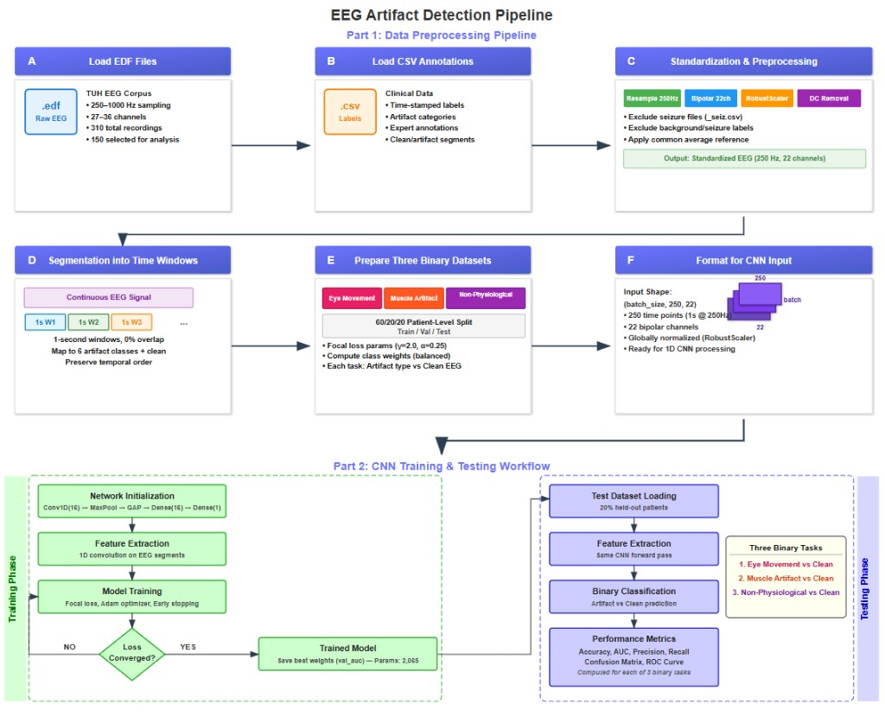

# A Lightweight Deep Convolutional Neural Network for Detecting Artifacts in Continuous EEG Signals
[](https://doi.org/10.5281/zenodo.19554506)

[](LICENSE)


<p align="center">
  
</p>
<p align="center"><em>End-to-end EEG artifact detection pipeline: data preprocessing (Part 1) and CNN training and testing workflow (Part 2).</em></p>

This repository contains the code for the paper **"A Lightweight Deep Convolutional Neural Network for Detecting Artifacts in Continuous EEG Signals"**.

It implements end-to-end EEG artifact detection using a Deep Lightweight 1D Convolutional Neural Network (DLCNN), together with literature-based rule-based methods. It targets three artifact categories derived from TUH annotations:

- **Eye movements** (TARGETED: EYE)
- **Muscle (EMG) artifacts** (TARGETED: MUSC, CHEW, SHIV)
- **Non-physiological artifacts** (TARGETED: ELEC, ELPP)

The pipeline includes preprocessing, binary dataset preparation per target, model training, threshold calibration on validation data, final evaluation on held-out test data, optional window-size sweeps, and comparison against rule-based detectors.

## Table of Contents

- [Installation](#installation)
- [Data Availability](#data-availability)
- [Repository Structure](#repository-structure)
- [Methodological Summary](#methodological-summary)
- [Typical Workflow](#typical-workflow)
- [Running Tests](#running-tests)
- [Notes on Models and Checkpoints](#notes-on-models-and-checkpoints)
- [Metrics and Reporting](#metrics-and-reporting)
- [Citation](#citation)
- [License](#license)

## Installation

```bash
# Install the package in editable mode (recommended for development)
pip install -e ".[dev]"

# Or install dependencies only
pip install -r requirements.txt
```

## Data Availability

This repository includes the trained inference assets, training code, and evaluation scripts used in the release. The TUH EEG Artifact Corpus used in this study is available through the Temple University Hospital EEG Corpus at <https://isip.piconepress.com/projects/nedc/html/tuh_eeg/>. Access requires completion of a data use agreement form submitted to [help@nedcdata.org](mailto:help@nedcdata.org).

**The published inference bundle.**

| Asset Type | Location |
|---|---|
| Final trained Keras models | `results/edl_cnn_eye/`, `results/edl_cnn_muscle/`, `results/edl_cnn_non_physiological/` |
| Best-validation weight checkpoints | `checkpoints/` |
| Shared normalization asset | `binary_models_data/robust_scaler.joblib` |
| Detector-specific operating points | `results/*_thresholds.json` |
| Detector input manifests | `binary_models_data/*/metadata.json` |
| Consolidated asset index | `inference_assets_manifest.json` |

To reproduce results locally, download the TUH EEG Artifact Corpus and place the EDF files under `edf/`. Then follow the [Typical Workflow](#typical-workflow) to preprocess, prepare binary datasets, and train/evaluate models.

### Using a Different Dataset

The DLCNN architecture, training loop, focal loss, and evaluation scripts are dataset-agnostic. However, the preprocessing pipeline (`artifact_identification/preprocessing.py`) is designed for the TUH EEG Artifact Corpus. To adapt it for a different dataset, modify the following:

| Component | What to change | Location |
|-----------|---------------|----------|
| **Annotation format** | The pipeline expects a CSV per recording with `start_time`, `stop_time`, and `label` columns. Reformat your annotations to match, or modify `load_and_validate_file()`. | `preprocessing.py` |
| **Artifact labels** | TUH-specific labels (`eyem`, `musc`, `elec`, `chew`, `shiv`, `elpp`) are mapped to integer classes in `CONFIG['artifact_mapping']`. Replace these with your dataset's label vocabulary. | `preprocessing.py` |
| **Channel montage** | A 22-channel bipolar montage based on the 10-20 system is assumed. Update `CONFIG['canonical_channels']` and `CONFIG['bipolar_pairs']` if your dataset uses a different electrode configuration. | `preprocessing.py` |
| **File format** | EDF (`.edf`) is expected. For other formats (BDF, GDF, etc.), update `load_and_validate_file()` to use the appropriate MNE reader. | `preprocessing.py` |

## Repository Structure

```
artifact_identification/          # Root repository
├── pyproject.toml                # Package configuration and dependencies
├── README.md
├── LICENSE
├── requirements.txt
│
├── artifact_identification/      # Python package
│   ├── __init__.py               # Package root (exports, __version__)
│   ├── _version.py               # Version string
│   ├── losses.py                 # Shared focal loss function
│   ├── preprocessing.py          # EEG preprocessing pipeline
│   ├── data_preparation.py       # Binary dataset preparation
│   ├── exploration.py            # Dataset exploration and analysis
│   ├── detectors/                # Artifact detectors
│   │   ├── __init__.py
│   │   ├── eye_movement.py       # DLCNN for eye movement artifacts
│   │   ├── muscle.py             # DLCNN for muscle artifacts
│   │   ├── non_physiological.py  # DLCNN for non-physiological artifacts
│   │   └── rule_based.py         # Heuristic rule-based detectors
│   ├── evaluation/               # Model evaluation
│   │   ├── __init__.py
│   │   ├── cnn_vs_rules.py       # CNN vs rule-based comparison
│   │   └── rule_based_eval.py    # Rule-based evaluation
│   └── utils/                    # Utilities
│       ├── __init__.py
│       ├── check_channels.py     # EDF channel inspection
│       └── check_edf.py          # EDF property inspection
│
├── scripts/                      # CLI entry points
│   ├── preprocess.py             # Run preprocessing pipeline
│   ├── prepare_data.py           # Prepare binary datasets
│   ├── train_eye.py              # Train eye movement detector
│   ├── train_muscle.py           # Train muscle artifact detector
│   ├── train_nonphys.py          # Train non-physiological detector
│   ├── evaluate_cnn_vs_rules.py  # CNN vs rules comparison
│   ├── evaluate_rule_based.py    # Rule-based evaluation
│   ├── explore_data.py           # Data exploration
│   └── window_optimization.py    # Window size sweep
│
├── tests/                        # Test suite
│   ├── test_losses.py            # Tests for focal loss
│   └── test_rule_based.py        # Tests for rule-based detectors
│
├── DOCS/                         # Montage and annotation documentation
├── binary_models_data/           # Generated datasets, scaler, and per-detector metadata
├── results/                      # Trained .keras models, thresholds, histories, and plots
└── checkpoints/                  # Best-validation .weights.h5 files
```

## Methodological Summary

- **Sampling rate**: 250 Hz; standardized 22-channel bipolar montage
- **Windows**: Non-overlapping; size is configurable (e.g., 1-30 s)
- **Split**: 60/20/20 at the patient/recording level to prevent leakage
- **Normalization**: RobustScaler (global fit on training set)
- **Loss**: Focal loss with class weights for imbalanced data
- **Threshold calibration** (validation set): Youden's J, fixed specificity, or max TPR at FPR <= 0.1
- **Metrics** (test set): Sensitivity, specificity, ROC AUC, prevalence-adjusted PR-AUC, partial ROC AUC at FPR <= 0.1
- **Rule-based detectors**: Literature-adapted bandpower, spectral slope, amplitude/variance, and line-noise features

## Typical Workflow

1. **Preprocess and window the data** (non-overlapping):

```bash
python -m scripts.preprocess --edf-dir edf/01_tcp_ar --max-files 150 --window-seconds 1 --overlap 0.0
```

2. **Build binary datasets** for each target:

```bash
python -m scripts.prepare_data
```

3. **Train a detector** (repeat per target as needed):

```bash
python -m scripts.train_eye
python -m scripts.train_muscle
python -m scripts.train_nonphys
```

4. **Compare CNN to rule-based methods**:

```bash
python -m scripts.evaluate_cnn_vs_rules
```

5. **Optional: Sweep window sizes**:

```bash
python -m scripts.window_optimization --target all --force
```

## Running Tests

```bash
# Run the full test suite
pytest

# Run with coverage
pytest --cov=artifact_identification --cov-report=term-missing
```

## Notes on Models and Checkpoints

- Final serialized models are saved under `results/<model_name>/<model_name>.keras`.
- Best validation weights are saved under `checkpoints/<target>/` with unique timestamps.
- Detector operating points are saved under `results/<model_name>/<model_name>_thresholds.json`.
- The shared preprocessing scaler is saved as `binary_models_data/robust_scaler.joblib`.
- Per-detector input manifests are saved under `binary_models_data/<target>/metadata.json`.
- Large intermediate arrays (`X_*`, `y_*`, and `split_indices.npz`) remain excluded from Git to keep the repository manageable.

## Metrics and Reporting

Detectors report: accuracy, precision, recall (sensitivity), specificity, F1, ROC AUC, PR AUC, prevalence-adjusted PR AUC, and partial ROC AUC (FPR <= 0.1). Thresholds are selected on the validation set and applied to the held-out test set.

Plots saved per run include training history, ROC/PR curves, confusion matrix, and prediction distributions.

## Citation

If this repository is useful in your work, please cite both the paper and the software:

**Paper:**
> E. Nyanney, P.D. Thirumala, S. Visweswaran, Z. Geng, A lightweight deep convolutional neural network for detecting artifacts in continuous EEG signals, *Clinical Neurophysiology Practice*, 11 (2026) 208–215. https://doi.org/10.1016/j.cnp.2026.03.005

**Software:**
> E. Nyanney, P.D. Thirumala, S. Visweswaran, Z. Geng, EEG-Artifact-Detection-DLCNN: A Lightweight Deep Convolutional Neural Network for Detecting Artifacts in Continuous EEG Signals (v1.0.0), Zenodo (2026). https://doi.org/10.5281/zenodo.19554506

### BibTeX

~~~bibtex
@article{nyanney2026dlcnn,
  title={A lightweight deep convolutional neural network for detecting artifacts in continuous EEG signals},
  author={Nyanney, Evans and Thirumala, Parthasarathy D and Visweswaran, Shyam and Geng, Zhaohui},
  journal={Clinical Neurophysiology Practice},
  year={2026},
  volume={11},
  pages={208--215},
  doi={10.1016/j.cnp.2026.03.005},
  url={https://doi.org/10.1016/j.cnp.2026.03.005}
}

@software{nyanney2026dlcnn_software,
  title={EEG-Artifact-Detection-DLCNN: A Lightweight Deep Convolutional Neural Network for Detecting Artifacts in Continuous EEG Signals},
  author={Nyanney, Evans and Thirumala, Parthasarathy D and Visweswaran, Shyam and Geng, Zhaohui},
  year={2026},
  version={v1.0.0},
  publisher={Zenodo},
  doi={10.5281/zenodo.19554506},
  url={https://doi.org/10.5281/zenodo.19554506}
}
~~~
For data, please acknowledge the Temple University Hospital EEG Corpus (TUH).

## License

MIT License. See [LICENSE](LICENSE) for details. Ensure compliance with TUH dataset usage terms.
